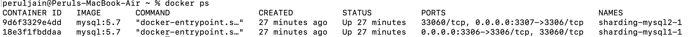

# Context
POC for mysql database sharding

# Approach
1. Created a two mysql instances 
2. Based on id%number_of_instances , route the request to mysql instance

# steps
1. docker-componse up 
2. docker ps
3. python3 sharding.py 
4. 
5. docker exec -it ${name} bash
6. mysql -u root -p root
 

# context
POC for mysql database sharding using proxysql

# Approach
1. Created a two mysql instances 
2. Created a proxysql instance
3. Based on even or odd primary key, route request to mysql instance

# steps
1. docker-compose up 
2. docker ps
3. python3 proxysql_sharding.py 
