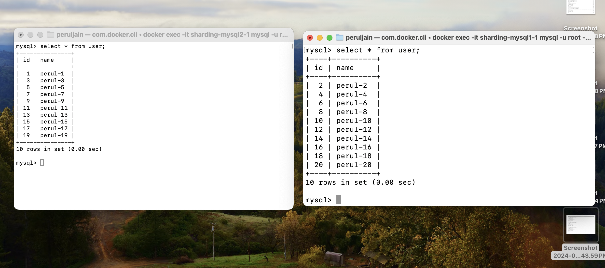

# Context
POC for mysql database sharding

# Approach
1. Created a two mysql instances 
2. Based on id%number_of_instances , route the request to mysql instance

# steps
1. docker-componse up -d
2. chmod +x table_create.sh
2. ./table_create.sh
3. python3 sharding.py 
4. 
5. docker exec -it ${name} bash
6. mysql -u root -proot
 

# context
POC for mysql database sharding using proxysql

# Approach
1. Created a two mysql instances 
2. Created a proxysql instance
3. Based on even or odd primary key, route request to mysql instance

# steps
1. docker-compose up 
2. docker ps
3. mysql -u admin -padmin -h localhost -P6032 --prompt='Admin> ' 
4. run queries
    1.  INSERT INTO mysql_query_rules (rule_id, active, match_pattern, destination_hostgroup, apply)
        VALUES (1, 1, 'INSERT INTO user \(id, name\) VALUES \([0-9]*([02468]\,)', 1, 1);
    2.  INSERT INTO mysql_query_rules (rule_id, active, match_pattern, destination_hostgroup, apply)
        VALUES (2, 1, 'INSERT INTO user \(id, name\) VALUES \([0-9]*([13579]\,)', 2, 1);
    3.  LOAD MYSQL QUERY RULES TO RUNTIME;    
    4.  SAVE MYSQL QUERY RULES TO DISK;
    5. SET mysql-eventslog_filename='/var/lib/proxysql/proxysql.log';
    6. SET mysql-eventslog_filesize=104857600;  -- Optional: Set the log file size
    7. SET mysql-eventslog_default_log=1;  -- Enable logging
    8. SET mysql-eventslog_format=1;  -- Set the log format (1 for text, 2 for JSON)
    9. LOAD MYSQL VARIABLES TO RUNTIME;
    10. SAVE MYSQL VARIABLES TO DISK;

5. python3 proxysql_sharding.py

